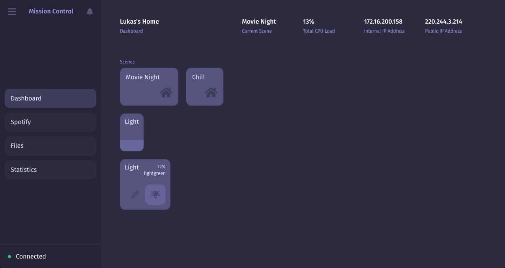

# Mission Control

> Beautiful home automation software built on Node.js and the Raspberry Pi.

[![NPM Version][npm-image]][npm-url]
[![Build Status][travis-image]][travis-url]
[![Downloads Stats][npm-downloads]][npm-url]

One to two paragraph statement about your product and what it does.



## Installation

OS X & Linux:

```sh
npm install my-crazy-module --save
```

Windows:

```sh
edit autoexec.bat
```

## Usage example

A few motivating and useful examples of how your product can be used. Spice this up with code blocks and potentially more screenshots.

_For more examples and usage, please refer to the [Wiki][wiki]._

## Development setup

Describe how to install all development dependencies and how to run an automated test-suite of some kind. Potentially do this for multiple platforms.

```sh
make install
npm test
```

## Release History

-   0.2.1
    -   CHANGE: Update docs (module code remains unchanged)
-   0.2.0
    -   CHANGE: Remove `setDefaultXYZ()`
    -   ADD: Add `init()`
-   0.1.1
    -   FIX: Crash when calling `baz()` (Thanks @GenerousContributorName!)
-   1.0.0
    -   The first proper release

## Authors

Lukas Mateffy – [@Capevace](https://twitter.com/capevace) – [mateffy.me](https://mateffy.me)

Distributed under the MIT license. See `LICENSE` for more information.

## Contributing

1. Fork it (<https://github.com/capevace/PROJECT/fork>)
2. Create your feature branch (`git checkout -b feature/fooBar`)
3. Commit your changes (`git commit -am 'Add some fooBar'`)
4. Push to the branch (`git push origin feature/fooBar`)
5. Create a new Pull Request

## Acknowledgments

Some acknowledgements.

<!-- Markdown link & img dfn's -->

[npm-image]: https://img.shields.io/npm/v/PROJECT.svg?style=flat-square
[npm-url]: https://npmjs.org/package/PROJECT
[npm-downloads]: https://img.shields.io/npm/dm/PROJECT.svg?style=flat-square
[travis-image]: https://img.shields.io/travis/dbader/node-datadog-metrics/master.svg?style=flat-square
[travis-url]: https://travis-ci.org/dbader/node-datadog-metrics
[wiki]: https://github.com/capevace/PROJECT/wiki
