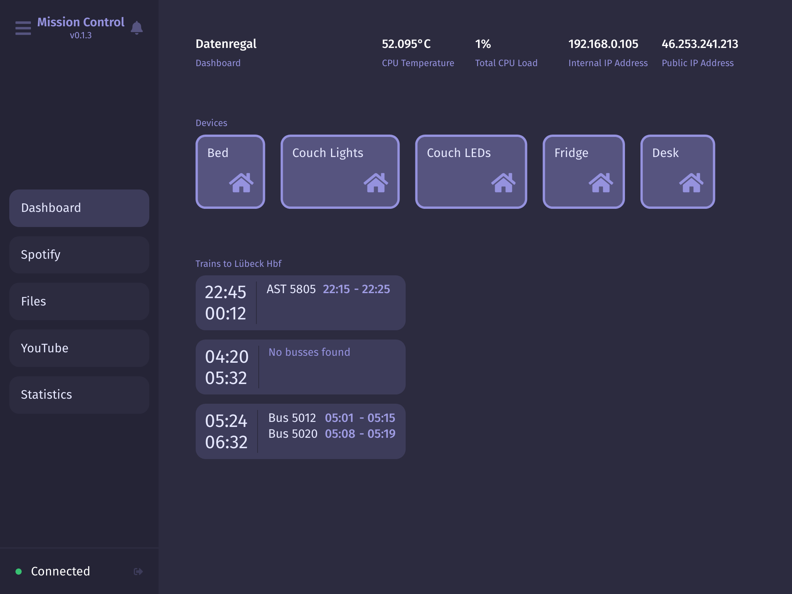

<div align="center">
	<a href="https://mateffy.me/mission-control-project">
		
	</a>
	<h1>Mission Control</h1>
	<p>
		Beautiful home dashboard software built on Node.js 
	</p>
	<p>
		<a href="https://mateffy.me/mission-control-project">Project Homepage</a>
		<span>&nbsp;|&nbsp;</span>
		<a href="https://mateffy.me/mission-control">Docs</a>
	</p>
</div>

<br>

When you start setting up software for your home – be it home automation, a NAS system or something else – you’ll end up having a few different dashboards for control, that are all kind of ugly anyway. That’s where Mission Control comes in. It is a beatutiful and easy-to-configure dashboard system for your home!

## Features

- Control your HomeKit devices on the dashboard
- Embeddable file browser, youtube downloader and Spotify player
- Sleek, customizable UI

## Installation

**Install mission-control and the single-sign-on auth server.** Unless reconfigured, mission control will launch a single-sign-on server as a node subprocess.

```sh
$ npm install -g @capevace/mission-control @capevace/single-sign-on
```

## Usage

You can now start the server like you would any binary.

```sh
$ mission-control --version
v0.3.2
```

### Options

```
Usage: mission-control [options]

Options:
  -V, --version       output the version number
  -u, --url <url>     the url mission control is reachable at
  -p, --port <port>   the port to use for mission control
  -n, --no-sso        disable internal auth server process (to use own)
  --auth-url <url>    the url to use for the single-sign-on server
  --auth-port <port>  the port to use for the single-sign-on server
  -h, --help          display help for command
```

### Config

A config file for mission-control will be created at `$HOME_DIR/.mission-control/config`. This can also be used to configure mission-control. However, options passed as command line arguments override settings in this file.

## Screenshots



## Changelog

### Version 0.5.4

- Rewrote logging system

### Version 0.5.3

- Added COVID widget to dashboard

### Version 0.5.2

- Fixed bahn algorithm skipping not displaying trains with SEV present

### Version 0.5.1

- Fixed dashboard layout now being loaded from database correctly

### Version 0.5.0

- New Dashboard is now customizeable

### Version 0.4.2

- Fixes error preventing the auth proxy from returning properly

### Version 0.4.1

- Fixes some minor security issues with dependencies

### Version 0.4.0

- The SSO server is now being proxied by default. This can be disabled with the `--no-proxy` option or by disabling it in the config file.
- Instead of localhost, the default url is now the local ip

## FAQ

### Running Mission Control on port 80

On Linux, running an http server on port 80 requires root priviliges. Generally this isn't a problem as you can simply `sudo mission-control -p 80` which works, but this approach falls apart when using systemd.

I found this workaround which seems to be the safest option to use instead:

```sh
sudo apt-get install libcap2-bin
sudo setcap 'cap_net_bind_service=+ep' /usr/bin/node # Replace path to node binary
```

## Authors

Lukas Mateffy – [@Capevace](https://twitter.com/capevace) – [mateffy.me](https://mateffy.me)

Distributed under the MIT license. See `LICENSE` for more information.

## Contributing

1. Fork it (<https://github.com/capevace/mission-control/fork>)
2. Create your feature branch (`git checkout -b feature/fooBar`)
3. Commit your changes (`git commit -am 'Add some fooBar'`)
4. Push to the branch (`git push origin feature/fooBar`)
5. Create a new Pull Request
